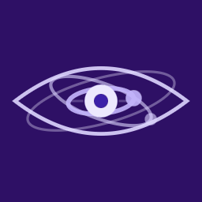
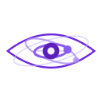

<div align="center">

<!-- Hero Section -->


<br/>



<br/>

### `Rewriting the rules. Redefining justice. Reshaping the future.`

<br/>

<a href="#about"></a>
<a href="#specialties"></a>
<a href="#vision"></a>

<br/><br/>

</div>

---

## About Us



**LAWstroGenesis** is a legal technology company born from a single conviction: *the law should work for everyone, not just those who can afford it.* We fuse cutting-edge technology with deep legal expertise to build tools that make the legal system faster, fairer, and fundamentally more accessible.

Our name carries our mission — **LAW** for the domain we serve, **Astro** for the heights we aim to reach, and **Genesis** for the new era of justice we're building.

<br/>

<div align="center">

```
  ┌─────────────────────────────────────────────────────────────────┐
  │                                                                 │
  │   "Technology is not the opposite of justice —                  │
  │    it is its greatest accelerator."                             │
  │                                                                 │
  └─────────────────────────────────────────────────────────────────┘
```

</div>

<br/>

---

## Our Specialties

<table>
<tr>
<td width="50%" valign="top">

###  AI-Driven Legal Intelligence
We develop intelligent systems that can analyze case law, identify precedents, and surface insights that would take human researchers weeks — in seconds. Our models are trained on legal corpora spanning multiple jurisdictions and decades of case history.

</td>
<td width="50%" valign="top">

###  Smart Contract & Compliance Automation
From regulatory compliance monitoring to self-executing smart contracts, we build automation pipelines that reduce legal overhead and eliminate human error in high-stakes processes.

</td>
</tr>
<tr>
<td width="50%" valign="top">

###  Access-to-Justice Platforms
We create open, multilingual platforms that guide individuals through legal processes — from tenant rights to immigration — without requiring an attorney. Justice shouldn't have a price tag.

</td>
<td width="50%" valign="top">

###  Legal Data Infrastructure
We architect the foundational data layers that power next-generation legal applications: standardized legal ontologies, interoperable case databases, and privacy-first identity verification systems.

</td>
</tr>
</table>

---

## Our Vision

<div align="center">


```
         ╔══════════════════════════════════════════════╗
         ║                                              ║
         ║     A world where the law is transparent,    ║
         ║     accessible, and intelligent enough        ║
         ║     to serve every person equally.            ║
         ║                                              ║
         ╚══════════════════════════════════════════════╝
```

</div>

We believe the legal system is one of the most impactful yet underserved domains in technology. While other industries have been transformed by AI, automation, and open data, the legal world remains locked behind jargon, paywalls, and inefficiency.

**We're here to change that.**

Our direction is clear:

- **Democratize legal knowledge** — Make legal information and guidance universally accessible through AI-powered tools and open-source platforms.
- **Automate the mundane, elevate the meaningful** — Free legal professionals from repetitive tasks so they can focus on advocacy, strategy, and human judgment.
- **Build trust through transparency** — Every algorithm we deploy is auditable. Every dataset we use is documented. We believe in earning trust, not demanding it.
- **Bridge jurisdictions** — Create interoperable legal frameworks that work across borders, languages, and legal traditions.

---

## How We Work

<div align="center">

| Principle | What It Means |
|:---------:|:--------------|
| **Open by Default** | We open-source our tools wherever possible. Innovation thrives in the open. |
| **Privacy First** | Legal data is sensitive. We build with zero-knowledge architectures and end-to-end encryption as non-negotiable standards. |
| **Human in the Loop** | AI advises. Humans decide. We never remove human judgment from consequential legal decisions. |
| **Jurisdiction Aware** | Our systems understand that law is local. We respect the nuance of every legal tradition we serve. |

</div>

---

## Tech Stack & Approach

```text
  AI/ML            │  NLP, Transformer models, Legal-domain LLMs, RAG pipelines
  Infrastructure   │  Cloud-native, Kubernetes, Event-driven architectures
  Data             │  Graph databases, Legal ontologies, FHIR-inspired legal data standards
  Security         │  Zero-trust, E2E encryption, SOC 2 compliant
  Frontend         │  Accessible-first design, WCAG 2.1 AA+, Multilingual
```

---

## Get Involved

We're always looking for people who believe technology can make justice more just.

- **Contribute** — Explore our repositories and open a PR. Every contribution matters.
- **Collaborate** — If you're a legal professional, researcher, or technologist with ideas, reach out.
- **Build With Us** — Check our open issues for ways to get started.

---

<div align="center">

<br/>

<picture>
  <source media="(prefers-color-scheme: dark)" srcset="../src/images/lawstrogenesis-dark-128x128.gif" />
  <source media="(prefers-color-scheme: light)" srcset="../src/images/lawstrogenesis-light-128x128.gif" />
  
</picture>

<br/>

**LAWstroGenesis** — *The genesis of a new era in law.*

<br/>

<a href="https://github.com/LAWstroGenesis"></a>

<br/><br/>


</div>
