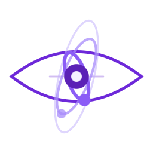

<picture>
  <source media="(prefers-color-scheme: dark)" srcset="../src/images/lawstrogenesis-dark-256x256.gif" />
  <source media="(prefers-color-scheme: light)" srcset="../src/images/lawstrogenesis-light-256x256.gif" />
  
</picture>

# LAWstroGenesis

### *Genesis begins where automation ends.*

&nbsp;
&nbsp;

---

## About Us

**LAWstroGenesis** is a legal technology company born from a single conviction: *the law should work for everyone, not just those who can afford it.*

We fuse cutting-edge AI with deep legal expertise to build tools that make the legal system faster, fairer, and fundamentally more accessible. Our name carries our mission — **LAW** for the domain we serve, **Astro** for the heights we aim to reach, and **Genesis** for the new era we're building.

> *"Technology is not the opposite of justice — it is its greatest accelerator."*

---

## AI-First Philosophy

We don't just use AI — we believe in it as a force that fundamentally changes what humans can achieve.

**AI is powerful enough to do the heavy lifting.** Code reviews, documentation, research, repetitive development tasks — these are problems AI already solves better and faster than humans grinding through them manually. We lean into that reality instead of fighting it.

**Humans should do what only humans can do.** Think deeply. Be creative. Experiment wildly. Meditate on hard problems. Dream up ideas that have never existed. When AI handles the grunt work, people get the room to do what actually matters.

**We don't replace people — we unleash them.** Every developer freed from boilerplate becomes an architect. Every researcher freed from manual review becomes a visionary. AI doesn't shrink the team — it multiplies what the team can imagine and build.

We actively adopt and advocate for AI-powered workflows across everything we build — from AI agents that write and review code, to intelligent systems that draft and analyze legal documents, to automated pipelines that replace entire manual processes. This isn't a future bet. This is how we operate today.

---

## Our Specialties

<table>
<tr>
<td width="50%" valign="top">

### AI-Driven Legal Intelligence

Intelligent systems that analyze case law, identify precedents, and surface insights in seconds — work that would take human researchers weeks. Our models span multiple jurisdictions and decades of case history.

</td>
<td width="50%" valign="top">

### Smart Contract & Compliance Automation

From regulatory compliance monitoring to self-executing smart contracts — automation pipelines that reduce legal overhead and eliminate human error in high-stakes processes.

</td>
</tr>
<tr>
<td width="50%" valign="top">

### Access-to-Justice Platforms

Open, multilingual platforms that guide individuals through legal processes — from tenant rights to immigration — without requiring an attorney. Justice shouldn't have a price tag.

</td>
<td width="50%" valign="top">

### Legal Data Infrastructure

The foundational data layers that power next-generation legal applications: standardized ontologies, interoperable case databases, and privacy-first identity verification.

</td>
</tr>
<tr>
<td width="50%" valign="top">

### AI-Powered Development

We use AI agents for code generation, code review, documentation, testing, and deployment. Our engineering culture is built around maximizing human creativity by offloading mechanical work to machines.

</td>
<td width="50%" valign="top">

### AI Adoption & Advocacy

We help organizations transition to AI-first workflows — not as a buzzword, but as a practical shift that frees teams to focus on strategy, experimentation, and the work that actually requires a human mind.

</td>
</tr>
</table>

---

## Our Vision

**A world where law is transparent, AI does the heavy lifting,**
**and humans are free to create, think, and push boundaries.**

 

- **Democratize legal knowledge** — Make legal information universally accessible through AI-powered tools and platforms.
- **Automate the mundane, elevate the meaningful** — Free professionals from repetitive tasks so they can focus on creativity, strategy, and bold ideas.
- **Let AI do what AI does best** — Code reviews, document analysis, research synthesis, compliance checks — machines handle the volume, humans handle the vision.
- **Build trust through transparency** — Every algorithm we deploy is auditable. Every dataset is documented. We earn trust, not demand it.
- **Bridge jurisdictions** — Create interoperable legal frameworks that work across borders, languages, and legal traditions.

---

## How We Work

| Principle | In Practice |
|:---------:|:------------|
| **AI First** | AI writes code, reviews PRs, drafts docs, and runs analysis. Humans direct, create, and decide. |
| **Privacy First** | Zero-knowledge architectures and E2E encryption as non-negotiable standards. |
| **Human Creativity in the Loop** | AI handles execution. Humans bring judgment, intuition, and imagination. |
| **Jurisdiction Aware** | Law is local. Our systems respect the nuance of every legal tradition. |

---

## Tech Stack

| Layer | Technologies |
|:-----:|:-------------|
| **AI/ML** | LLMs, AI Agents, RAG pipelines, Legal-domain models |
| **Automation** | AI code review, AI doc generation, CI/CD with AI gates |
| **Infrastructure** | Cloud-native, Kubernetes, Event-driven architectures |
| **Data** | Graph databases, Legal ontologies, Interoperable standards |
| **Security** | Zero-trust, E2E encryption, SOC 2 compliant |
| **Frontend** | Accessible-first design, WCAG 2.1 AA+, Multilingual |

---

## Get Involved

We're looking for people who believe AI can make justice more just — and humans more free.

- **Contribute** — Explore our repositories and open a PR.
- **Collaborate** — Legal professionals, researchers, technologists — reach out.
- **Build With Us** — Check our open issues for ways to get started.

---

**LAWstroGenesis** — *The genesis of a new era in law and AI.*

